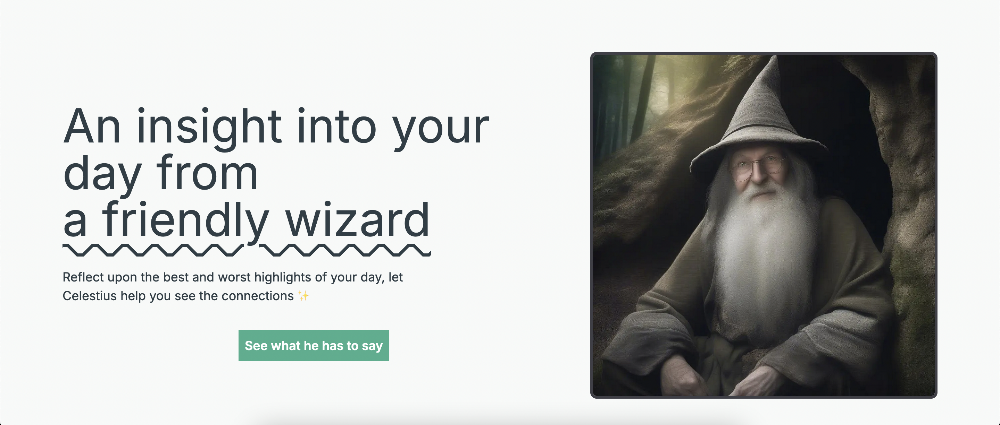

## Celestius

> Reflect upon the best and worst highlights of your day, let a friendly and wise wizard AI provide an insight to help you see how things are interconnected. 



*Created for Empower Hacks 2024.*

### To run locally

Clone the repository:

```
git clone git@github.com:rivea0/celestius.git
```

`cd` into it:

```
cd celestius
```

Install dependencies:

```
npm install
```

Create `.env.local` for environment variables:

```
touch .env.local
```

Add your Hugging Face token and `http://localhost:3000` as `URL` to environment variables:

```
HF_TOKEN=
URL=http://localhost:3000
```

Run the server:

```
npm run dev
```

#### Credits
Built with [Next.js](https://nextjs.org), [Huggingface.js](https://huggingface.co/docs/huggingface.js) and ❤️.

The wizard images are generated using [stabilityai/stable-diffusion-xl-base-1.0](https://huggingface.co/stabilityai/stable-diffusion-xl-base-1.0).

Logo is adapted from [SVGRepo](https://www.svgrepo.com/svg/96146/halloween-witch-hat-outline).

#### License
MIT
